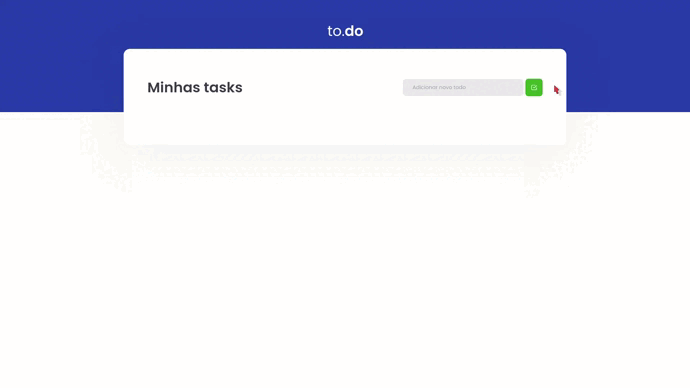

# to.do  ✅
## React Concepts
### Module 1 - Challenge 1 - RocketSeat - Ignite ReactJS 🔥
---
<p>
  <a href="https://rocketseat.com.br">
    
  </a>
  
  
  <a href="https://opensource.org/licenses/MIT">
    
  </a>
</p>

A task management application developed during the first Ignite challenge, Rocketseat bootcamp, through the application you are able to:

- Add a new task
- Remove a task
- Mark and unmark a task as complete.

## Application in Use



<br>

## Running The Project

```bash
# Open a terminal and copy this repository with the command
git clone https://github.com/jorgeeder/todo-ignite-challenge-01

# or use the download option.

# Enter the folder with
cd todo-ignite-challenge-01

# Install dependencies
yarn install
or
npm install

# Run the application
yarn dev
or 
npm dev

# Access http://localhost:8080 in your browser
```

<br>

## License

This project is under the MIT license. See the [LICENSE](/LICENSE) file for more details.

Made with 💜 by [Jorge Eder](https://github.com/jorgeeder)

<p>
  <a href="https://www.linkedin.com/in/jorgeeder/">
      
  </a>
  <a href = "mailto:jorgeeder.dev@gmail.com">
  
  </a>
</p>

